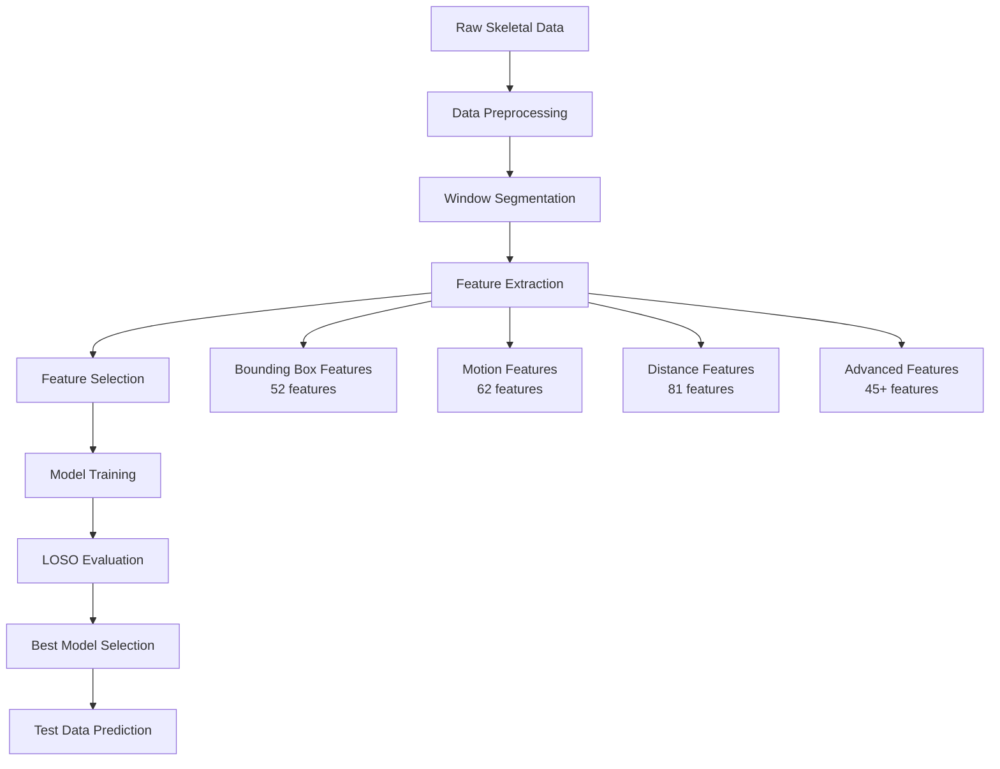

# ISAS Human Activity Recognition (HAR) - Skeleton-based Action Classification

🏆 **Advanced Human Activity Recognition using 2D Skeletal Keypoints for Neurodevelopmental Disability Monitoring**

[](https://python.org)
[](https://jupyter.org)
[](https://scikit-learn.org)
[](LICENSE)

## 📋 Tổng Quan Dự Án

Dự án này phát triển một hệ thống phân loại hành vi tự động sử dụng dữ liệu 2D skeletal keypoints, tập trung vào việc giám sát các hành vi ở người khuyết tật phát triển thần kinh (NDD). Hệ thống sử dụng các kỹ thuật feature engineering tiên tiến và ensemble learning để đạt được độ chính xác cao trong việc phân loại 8 loại hành vi khác nhau.

### 🎯 Mục Tiêu Chính
- **Phân loại hành vi tự động**: Nhận dạng 8 loại hành vi từ dữ liệu skeletal keypoints
- **Generalization**: Đảm bảo model hoạt động tốt với người dùng mới (LOSO evaluation)
- **Privacy-preserving**: Sử dụng skeletal data thay vì video RGB để bảo vệ privacy
- **Real-time capability**: Thiết kế cho ứng dụng giám sát thời gian thực

## 🎬 Các Lớp Hành Vi

| ID | Hành Vi | Mô Tả | Loại |
|----|---------|-------|------|
| 0 | **Sitting quietly** | Ngồi yên, ít chuyển động | Bình thường |
| 1 | **Walking** | Đi bộ | Bình thường |
| 2 | **Using phone** | Sử dụng điện thoại | Bình thường |
| 3 | **Eating snacks** | Ăn snack | Bình thường |
| 4 | **Biting** | Cắn | Bất thường |
| 5 | **Attacking** | Tấn công | Bất thường |
| 6 | **Head banging** | Đập đầu | Bất thường |
| 7 | **Throwing things** | Ném đồ vật | Bất thường |

## 🏗️ Kiến Trúc Hệ Thống

### 📊 Pipeline Tổng Quan



### 🔧 Feature Engineering Framework

#### 1. **Bounding Box Features (52 features)**
- Width, height, area, aspect ratio dynamics
- Center movement patterns và trajectory analysis
- Temporal derivatives (velocity, acceleration)
- Statistical measures (mean, std, range, percentiles)

#### 2. **Motion Features (62 features)**
- Individual keypoint velocities và accelerations
- Overall motion energy và RMS values
- Frequency domain analysis (FFT, dominant frequencies)
- Rhythmicity và periodicity detection

#### 3. **Distance Features (81 features)**
- Inter-joint distances (hand span, shoulder width, etc.)
- Body part relationships và postural analysis
- Symmetry indices và stability measures
- Limb coordination patterns

#### 4. **Advanced Features (45+ features)**
- **3-State Analysis**: Still, Moving, Stop states
- **Cross-correlation**: Inter-limb coordination
- **Entropy measures**: Signal complexity
- **Fractal dimensions**: Movement patterns
- **Engineered combinations**: Multi-modal interactions

## 🧠 Machine Learning Models

### 📈 Model Comparison

| Model | CV Accuracy | LOSO Accuracy | Generalization |
|-------|-------------|---------------|----------------|
| **Extra Trees** | 94.88% ± 0.73% | **~74%** | ⭐⭐⭐⭐⭐ |
| **Random Forest** | 95.44% | **~74%** | ⭐⭐⭐⭐⭐ |
| **XGBoost** | 97.16% | ~64% | ⭐⭐⭐ |
| **Neural Network** | 94.79% ± 0.58% | ~60% | ⭐⭐⭐ |
| **SVM** | 89.79% ± 1.14% | ~65% | ⭐⭐⭐ |

### 🏆 Best Model: Extra Trees / Random Forest
- **LOSO Accuracy**: ~74% (real-world performance)
- **Robustness**: Stable across different subjects
- **Feature Importance**: Excellent interpretability
- **Speed**: Fast training và prediction

## 📈 Evaluation Protocol

### 🎯 Leave-One-Subject-Out (LOSO) Cross-Validation
Đây là phương pháp evaluation nghiêm ngặt nhất để đánh giá khả năng generalization:

```python
for each subject:
    train_on_other_subjects()
    test_on_current_subject()
    calculate_metrics()
```

**Tại sao LOSO quan trọng?**
- Mô phỏng tình huống thực tế: deploy model cho người dùng mới
- Tránh overfitting đến specific subjects
- Đánh giá true generalization capability

## 🚀 Cách Sử Dụng

### 📋 Requirements

```bash
pip install -r requirements.txt
```

**Thư viện chính:**
- `pandas >= 1.3.0`
- `numpy >= 1.21.0`
- `scikit-learn >= 1.0.0`
- `xgboost >= 1.5.0`
- `matplotlib >= 3.5.0`
- `seaborn >= 0.11.0`
- `scipy >= 1.7.0`

### 🏃‍♂️ Quick Start

1. **Chạy notebook chính:**
```bash
jupyter notebook "ISAS_BEST (2).ipynb"
```

2. **Data structure cần thiết:**
```
Train_Data/
├── keypointlabel/
│   ├── keypoints_with_labels_1.csv
│   ├── keypoints_with_labels_2.csv
│   ├── keypoints_with_labels_3.csv
│   └── keypoints_with_labels_5.csv
└── ...
```

3. **Feature extraction và training:**
```python
# Initialize feature extractor
feature_extractor = ISASWindowFeatureExtractor(window_size=150)

# Extract features
X, y, subjects = feature_extractor.create_windowed_dataset(data)

# Train models với LOSO evaluation
loso_evaluator = LOSOEvaluator()
results = loso_evaluator.perform_loso_evaluation(X, y, subjects, models)
```

## 📊 Kết Quả Chính

### 🎯 Performance Metrics (LOSO)
- **Overall Accuracy**: 74.04% (Random Forest)
- **Subject Consistency**: Stable performance across all subjects
- **Per-class F1-scores**: Detailed analysis in notebook

### 📈 Key Findings
1. **Feature Engineering** quan trọng hơn model complexity
2. **Tree-based models** generalize tốt hơn deep learning với limited data
3. **3-State analysis** cải thiện đáng kể classification performance
4. **Distance features** là discriminative nhất cho action recognition

## 📝 Paper Outline

Dự án này đang được chuẩn bị để publication với outline sau:

### 1. Introduction
- **Context**: Automated behavior monitoring for NDD
- **Problem**: Generalization và fine-grained discrimination
- **Solution**: Feature-driven ensemble approach với LOSO evaluation

### 2. Related Work
- Skeleton-based HAR methods
- Handcrafted vs Deep Learning approaches
- Generalization challenges in HAR

### 3. Methodology
- **Framework**: Window-based feature extraction pipeline
- **Dataset**: ISAS challenge with 4 subjects, 8 actions
- **Features**: 240+ comprehensive features across 4 categories
- **Models**: Ensemble approach với systematic evaluation

### 4. Experiments and Results
- **LOSO Evaluation**: Rigorous generalization testing
- **Feature Importance**: Analysis of most discriminative features
- **Comparison**: Multiple model architectures

### 5. Discussion
- **Interpretability**: Why feature-driven approach works
- **Limitations**: Dataset size và simulation vs real-world
- **Future Work**: Real-time implementation và larger datasets

## 🔬 Technical Details

### 📏 Window Configuration
- **Window Size**: 150 frames (~5 seconds at 30 FPS)
- **Overlap**: 50% (sliding window approach)
- **Minimum Dominant Action**: 70% threshold

### 🎛️ Feature Selection Strategy
- **Correlation filtering**: Remove highly correlated features (>0.95)
- **Category-based selection**: Top features from each category
- **Importance ranking**: F-score, Mutual Information, RF importance

### ⚙️ Model Configuration
```python
# Extra Trees (Best Model)
ExtraTreesClassifier(
    n_estimators=200,
    max_depth=15,
    min_samples_split=5,
    min_samples_leaf=2,
    random_state=42
)
```

## 📁 Project Structure

```
ISAS/
├── ISAS_BEST (2).ipynb          # Main research notebook
├── README.md                     # This file
├── requirements.txt              # Dependencies
├── Train_Data/                   # Dataset
│   ├── keypointlabel/           # Labeled skeletal data
│   └── ...
├── check/                       # Analysis scripts
├── output/                      # Results và visualizations
└── ...
```

## 🤝 Contributing

Contributions welcome! Areas for improvement:
- **Real-time optimization**: Reduce inference time
- **Additional features**: New motion descriptors
- **Deep learning**: Hybrid approaches
- **Larger datasets**: More subjects và environments

## 📄 License

This project is licensed under the MIT License - see the [LICENSE](LICENSE) file for details.

## 🙏 Acknowledgments

- **ISAS Challenge 2025** organizers
- **Research Team**: Feature engineering và evaluation methodology
- **Community**: Open-source libraries và tools used

## 📞 Contact

For questions about this research:
- **Repository**: [GitHub Issues](../../issues)
- **Email**: Contact through GitHub profile

---

**⭐ Nếu project này hữu ích cho bạn, hãy star repository để support nghiên cứu!**

*Developed for ISAS Challenge 2025 - Human Activity Recognition using Skeletal Keypoints* 