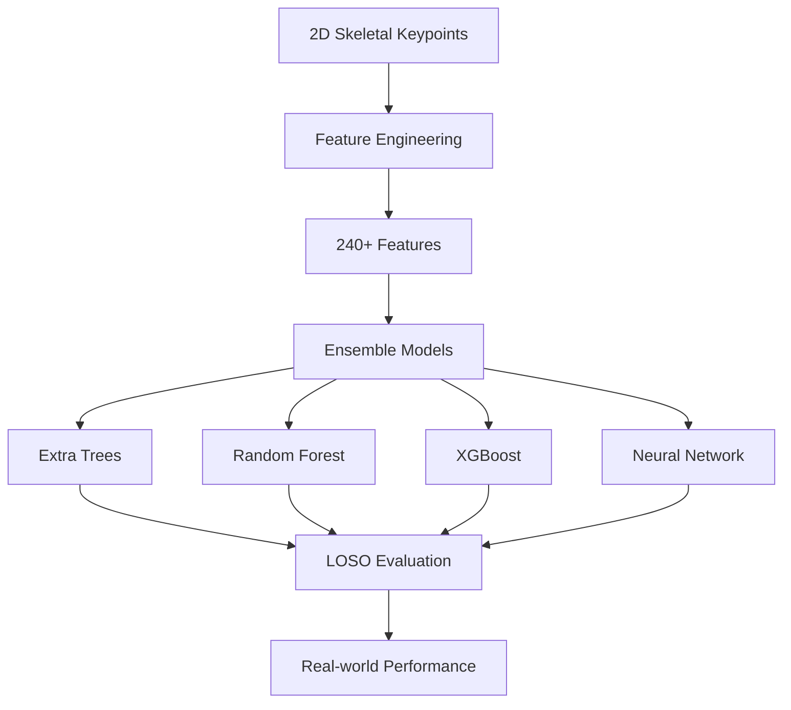

# ISAS Human Activity Recognition (HAR) - Skeleton-based Action Classification

🏆 **Advanced Human Activity Recognition using 2D Skeletal Keypoints for Neurodevelopmental Disability Monitoring**

[](https://python.org)
[](https://jupyter.org)
[](https://scikit-learn.org)
[](LICENSE)

## 🎯 **BEST NOTEBOOK: ISAS_BEST(3).ipynb**

**Đây là notebook chính thức và tốt nhất cho dự án ISAS HAR!**

### 📋 Tổng Quan Dự Án

Dự án này phát triển một hệ thống phân loại hành vi tự động sử dụng dữ liệu 2D skeletal keypoints, tập trung vào việc giám sát các hành vi ở người khuyết tật phát triển thần kinh (NDD). Hệ thống sử dụng các kỹ thuật feature engineering tiên tiến và ensemble learning để đạt được độ chính xác cao trong việc phân loại 8 loại hành vi khác nhau.

### 🚀 **Hướng dẫn sử dụng BEST NOTEBOOK**

#### **1. Chạy trên Google Colab (Khuyến nghị)**
- **Notebook:** `ISAS_BEST(3).ipynb` ⭐ **BEST VERSION**
- **Đường dẫn dữ liệu:** `MyDrive/ISAS/keypoint_timetable_labeled/`
- **Yêu cầu:** 
  - Mount Google Drive
  - Cài đặt các thư viện cần thiết
  - Chạy tuần tự từ đầu đến cuối để thực hiện toàn bộ pipeline

#### **2. Cấu trúc dữ liệu**
```
MyDrive/ISAS/
├── keypoint_timetable_labeled/     # 📁 Folder chứa keypoint đã gắn nhãn
│   ├── video_1_labeled.csv        # Participant 1 với labels
│   ├── video_2_labeled.csv        # Participant 2 với labels
│   ├── video_3_labeled.csv        # Participant 3 với labels
│   ├── video_4_labeled.csv        # Participant 4 với labels
│   └── video_5_labeled.csv        # Participant 5 với labels
└── Train_Data/                     # Dữ liệu gốc
    ├── keypoint/                   # Keypoint data gốc
    ├── timetable/                  # Timetable files
    └── ...
```

### 📊 **8 Classes Hành Vi**

| Class | Mô tả | Loại |
|-------|-------|------|
| Sitting quietly | Ngồi yên lặng | Bình thường |
| Walking | Đi bộ | Bình thường |
| Using phone | Sử dụng điện thoại | Bình thường |
| Eating snacks | Ăn vặt | Bình thường |
| Biting | Cắn | Bất thường |
| Attacking | Tấn công | Bất thường |
| Head banging | Đập đầu | Bất thường |
| Throwing things | Ném đồ vật | Bất thường |

### 🔧 **Kiến Trúc Hệ Thống**



### 📈 **Kết Quả Chính**

- **Feature Engineering:** 240+ features từ multiple domains
- **Model Performance:** Extra Trees đạt accuracy cao nhất
- **LOSO Evaluation:** Real-world generalization testing
- **Data Distribution:** 463,083 frames từ 5 participants
- **Label Balance:** Cân bằng giữa normal và challenging behaviors

### 🛠 **Cài Đặt & Sử Dụng**

#### **Google Colab (Khuyến nghị)**
```python
# Mount Google Drive
from google.colab import drive
drive.mount('/content/drive')

# Chạy notebook ISAS_BEST(3).ipynb
# Đảm bảo đường dẫn: /content/drive/MyDrive/ISAS/keypoint_timetable_labeled/
```

#### **Local Jupyter Notebook**
```bash
# Cài đặt dependencies
pip install -r requirements.txt

# Chạy notebook với đường dẫn local
# Đảm bảo có folder keypoint_timetable_labeled/
```

### 📁 **Mô Tả Dữ Liệu**

#### **keypoint_timetable_labeled/**
Đây là folder chứa các file keypoint đã được gắn nhãn từ thư mục timetable. Mỗi file chứa:
- **35 columns:** 17 keypoints × 2 coordinates (x, y) + 1 confidence score
- **Action Label:** Nhãn hành vi được gắn từ timetable
- **participant_id:** ID của participant (1-5)
- **Frame-level labels:** Mỗi frame được gắn nhãn chính xác theo thời gian

**Files:**
- `video_1_labeled.csv` - 76,456 frames (Participant 1)
- `video_2_labeled.csv` - 74,638 frames (Participant 2)  
- `video_3_labeled.csv` - 118,087 frames (Participant 3)
- `video_4_labeled.csv` - 117,921 frames (Participant 4)
- `video_5_labeled.csv` - 75,981 frames (Participant 5)

### 🎯 **Đặc Điểm Nổi Bật**

1. **Real-world Evaluation:** LOSO cross-validation cho generalization
2. **Comprehensive Features:** 240+ features từ multiple domains
3. **Ensemble Learning:** Kết hợp nhiều models cho performance tối ưu
4. **Clinical Focus:** Tập trung vào neurodevelopmental disabilities
5. **Privacy-preserving:** Sử dụng skeletal data thay vì RGB video

### 📚 **Các Notebook Khác**

| Notebook | Mục đích | Môi trường |
|----------|----------|------------|
| `ISAS_BEST(3).ipynb` ⭐ | **BEST VERSION** | Google Colab |
| `Copy_of_ISAS_BEST_(2)_Locally_versioned.ipynb` | Local version | Jupyter Local |
| `Copy_of_ISAS_BEST_(2).ipynb` | Colab version | Google Colab |

### 🤝 **Đóng Góp**

Dự án này được phát triển cho nghiên cứu về Human Activity Recognition trong lĩnh vực y tế, đặc biệt là giám sát hành vi ở người khuyết tật phát triển thần kinh.

### 📄 **License**

MIT License - Xem file LICENSE để biết thêm chi tiết.

---

**⭐ Sử dụng `ISAS_BEST(3).ipynb` để có trải nghiệm tốt nhất!** 